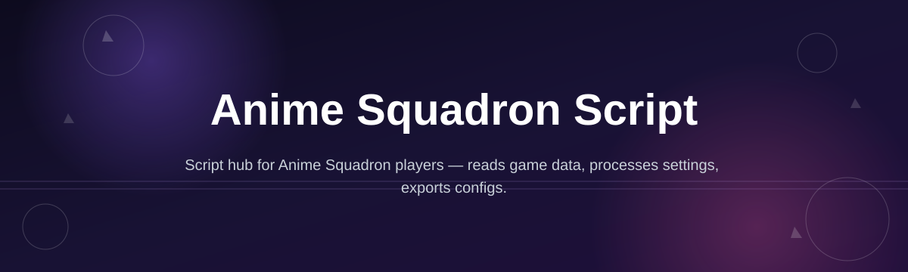
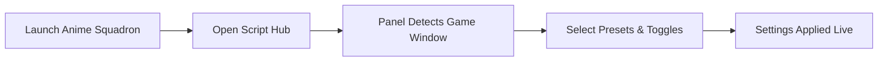

# anime-squadron-script-hub

*A single floating panel for Anime Squadron players who are tired of digging through in-game menus every round.*

## What this is

Anime Squadron Script is a standalone Windows companion for the game Anime Squadron. It sits as a lightweight overlay next to your game window and gives you one place to manage the things you'd otherwise repeat manually round after round — loadout swaps, formation presets, and session tracking chief among them. It's not a mod and it doesn't touch your game files; it's a separate app you run alongside the game.

The project started because a small group of Anime Squadron players got tired of alt-tabbing through nested menus mid-match just to change a formation or check a session timer. anime-squadron-script-hub packages those repeated actions into a panel you can position once and reuse every session. It's built to stay out of the way — no forced accounts, no background services, no toolchain to install.

  

The button opens the project's landing page, where the current Windows build is hosted for download.

## Who it is for

1. **New Anime Squadron players** who find the in-game menu structure confusing during their first matches.
2. **Long-session grinders** who repeat the same formation and loadout swaps dozens of times per sitting.
3. **Squad or clan organizers** who need a quick way to check timers and coordinate presets across a group.
4. **Returning players** catching up on Anime Squadron after a break and relearning menu layouts.
5. **Content creators** who want a clean, readable overlay for stream and recording sessions.

## What you can do

1. **Position a floating panel anywhere on screen** — it remembers where you left it between sessions.
2. **Save and switch loadout presets** without reopening the in-game selection menus each time.
3. **Track session length and round counts** with a built-in timer that resets automatically per match.
4. **Bind keyboard shortcuts** to your most-used panel actions instead of clicking through submenus.
5. **Switch between light and dark panel themes** to match your stream overlay or personal preference.
6. **Log recent actions** in a small activity list so you can see what changed and when.
7. **Auto-detect the Anime Squadron window** so the panel snaps into place without manual alignment.
8. **Export your saved presets** to a plain text file so you can back them up or move them to another PC.

## Getting started

1. Open the landing page using the download button above.
2. Download the current Windows build — it's a single `.exe`, no installer wizard.
3. Run the file. Windows SmartScreen may flag it as unrecognized; click "More info" → "Run anyway" to continue.
4. Launch Anime Squadron first, then start the script hub — it will detect the game window on its own.
5. Set up your presets and panel position once; the hub keeps them for next time.

## Requirements

1. Windows 10 or Windows 11, 64-bit.
2. Around 150 MB of free disk space for the app and saved presets.
3. No installer, no toolchain, no separate runtime — it runs standalone from the downloaded file.
4. Anime Squadron installed and running in the same session (the hub is a companion, not a replacement).

## How it works

1. You launch Anime Squadron as usual, then start the script hub separately.
2. The hub scans for the game window and anchors the panel near it.
3. You pick or edit presets — formations, loadouts, timers — from the panel UI.
4. Changes apply to the panel state immediately; nothing is written into the game's own files.
5. On close, your layout and presets are saved locally for the next session.

## FAQ

**Is Anime Squadron Script safe to run alongside the game?**
Yes — it runs as a separate process and reads window position only to anchor the panel. It doesn't modify Anime Squadron's installation or save files.

**Does this change or replace any in-game files?**
No. All presets and settings are stored in the hub's own local folder, not inside the game's directory.

**Why does Windows show a warning when I open the download?**
The build isn't signed with a paid certificate, so SmartScreen flags it as unrecognized by default. This is common for small independent tools and doesn't indicate a problem with the file itself.

**Can I use this on Mac or Linux?**
Not currently. The hub is built and tested for Windows 10/11 only.

**Do I need to redownload after an Anime Squadron update?**
Usually not, since the hub doesn't depend on internal game files. If the game changes its window layout significantly, check the landing page for an updated build.

## Troubleshooting